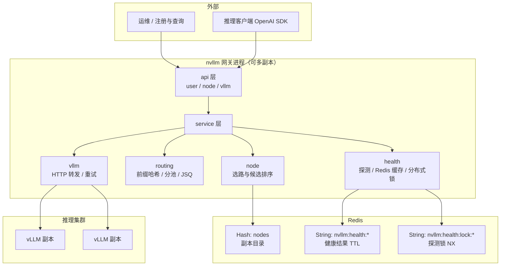
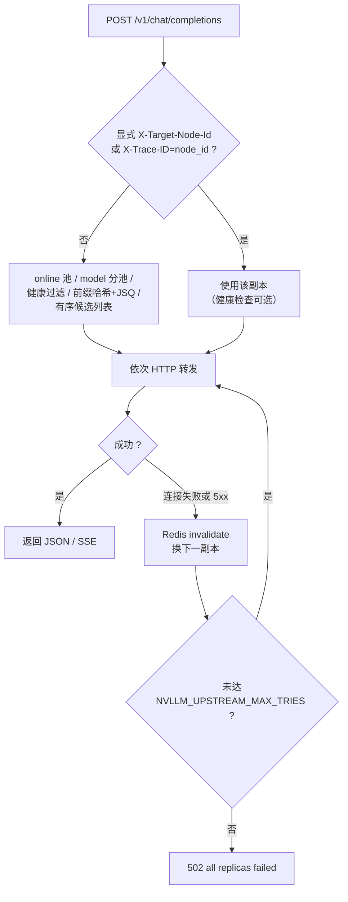

# vLLM 负载均衡服务

基于 **Flask** 的推理网关与控制面：在 **Redis** 中维护 vLLM **副本目录**（地址、负载指标、`served_model_name` 等），对 **OpenAI 兼容** 推理请求做 **选路、健康检查、故障重试** 与 HTTP 转发。多网关实例通过 Redis 共享目录与健康视图；探测使用 **分布式锁** 避免并发打满同一副本。

## 功能特性

- 🔐 **JWT 身份认证** — 节点管理类 API 需 Bearer Token
- 🖥️ **节点管理** — 注册 / 更新 / 删除 / 查询；登记 `served_model_name` 支持多模型分池
- 📊 **状态字段** — `NodeInfo`：`running` / `waiting` / `kv_cache`（供 JSQ 与调度参考）
- 🗄️ **Redis** — 节点目录与健康缓存、探测锁共用同一实例时可跨网关一致
- ⚖️ **选路** — 前缀 **SHA256** 亲和 + **JSQ**；显式头 `X-Target-Node-Id`、`X-Trace-ID`（等于 node_id 时粘性）
- 🏥 **运维健康** — 可选 `GET /health`；集群内 **SET NX** 探测锁；可选 **心跳线程** 定时刷新
- 🔁 **上游重试** — 连接失败或下游 **5xx** 换副本重试，Redis 标记不健康
- 📝 **可观测** — `X-Trace-ID`；无法派发时返回 `code`（如 `NO_MODEL_POOL`）

## 技术栈

- **框架**: Flask
- **HTTP 客户端**: requests
- **认证**: PyJWT
- **存储**: Redis（redis-py）
- **可选**: flask-cors、gunicorn

## 项目结构

```
nvllm/
├── api/                    # API 路由层
│   ├── __init__.py        # 路由注册
│   ├── node.py            # 节点管理 API
│   ├── vllm.py            # OpenAI 兼容转发 /v1
│   └── user.py            # 用户认证 API
├── service/               # 业务逻辑层
│   ├── node.py            # 节点与选路入口
│   ├── routing.py         # 前缀哈希、分池、JSQ
│   ├── health.py          # 副本存活探测与缓存
│   ├── errors.py          # 路由异常类型
│   └── vllm.py            # 下游 HTTP 转发与重试
├── model/                 # 数据模型
│   ├── base.py            # 响应模型
│   └── node.py            # 节点模型（Node / NodeInfo）
├── middleware/            # 中间件
│   ├── auth.py            # JWT 认证中间件
│   └── redis_client.py    # Redis 客户端
├── cache/                 # 缓存模块（预留）
├── client/                # vLLM 侧上报脚本（独立依赖）
│   ├── nvllm_sidecar.py   # 登录 / 注册 / 周期更新节点指标
│   └── requirements.txt
├── main.py                # 应用入口（注册路由 + 可选健康心跳线程）
└── requirements.txt       # 项目依赖
```

## 系统架构

### 组件关系（控制面 · 数据面）



### 单次推理请求路径（简图）



### 部署要点

- **水平扩展**：多 nvllm 进程共用同一 Redis 即可共享 **目录与健康状态**；探测锁降低多实例同时探测同一 vLLM 的压力。
- **Gunicorn**：`main:app` 会在加载模块时执行 `start_background_health_prober()`；**每 worker 一条心跳线程**（若开启 `NVLLM_HEALTH_BG_INTERVAL_SEC`），与分布式锁配合仍可接受。
- **main.py 未启用 CORS**：若浏览器直连网关需在 `main.py` 自行挂载 `flask-cors`（依赖已在 requirements.txt）。

## 安装与配置

### 环境要求

- Python 3.8+
- Redis 服务器

### 安装步骤

1. **克隆项目**

```bash
git clone <repository-url>
cd nvllm
```

2. **创建虚拟环境**

```bash
python -m venv venv
source venv/bin/activate  # Linux/Mac
# 或
venv\Scripts\activate     # Windows
```

3. **安装依赖**

```bash
pip install -r requirements.txt
```

4. **启动 Redis 服务**

```bash
# 确保 Redis 服务正在运行
redis-server
```

## 配置说明

### JWT 密钥配置

在 `middleware/auth.py` 中配置 JWT 密钥：

```python
SECRET_KEY = "your-jwt-secret-key"  # 请修改为安全的密钥
```

### Redis 配置

在 `middleware/redis_client.py` 中配置 Redis 连接信息（如需要）。

### 推理负载均衡（控制面选路）

面向大规模同构/多模型副本时的默认策略：

1. **显式路由**：请求头 `X-Target-Node-Id` 指向登记过的 `node_id`；`X-Trace-ID` 若与某 `node_id` 相同则固定到该副本。
2. **多模型分池**：节点可登记 `served_model_name`（与 OpenAI 请求体 `model` 一致）。仅当请求带 `model` 时，候选副本限定为该模型；**不会**把流量派发到错误模型。未带 `model` 时优先使用 `served_model_name` 为空的通用池；若集群尚未配置该字段则退回全池（兼容旧数据）。
3. **前缀亲和**：对请求正文中的 prompt/messages 文本前缀做 **SHA256** 稳定哈希，映射到有序副本列表中的一槽，利于 prefix KV 局部性。
4. **JSQ 回退**：若亲和副本的 `running+waiting` 高于全局最小超过阈值，则改派到负载最低副本。
5. **健康检查（运维）**：可选对副本发起 HTTP GET（默认路径 `/health`）；**探测结果写入 Redis**；同一副本在集群内**同一时间仅一处发起 HTTP 探测**（Redis `SET NX` 分布式锁，前缀见 `NVLLM_HEALTH_LOCK_PREFIX`）。设置 `NVLLM_HEALTH_CHECK=1` 启用。
6. **心跳探测（可选）**：`NVLLM_HEALTH_BG_INTERVAL_SEC>0` 时在进程内启动守护线程，按间隔遍历 catalog 并 **强制刷新** 健康缓存（仍走分布式锁，与请求路径一致）。
7. **上游故障重试**：对单次推理依次尝试多个副本（首选亲和/JSQ，其余按负载升序）；**连接失败**或副本返回 **5xx** 时将该副本标记不健康并重试，次数由 `NVLLM_UPSTREAM_MAX_TRIES` 限制；全部失败返回 HTTP **502**，正文含 `detail`。

可选环境变量：

| 变量 | 默认 | 说明 |
|------|------|------|
| `NVLLM_ROUTING_PREFIX_CHARS` | `8192` | 参与哈希的文本最大字符数 |
| `NVLLM_AFFINITY_LOAD_MARGIN` | `2` | 亲和副本允许比全局最小负载（running+waiting）多出的量，超出则 JSQ |
| `NVLLM_HEALTH_CHECK` | `0` | `1`/`true` 启用存活探测 |
| `NVLLM_HEALTH_PATH` | `/health` | 探测 URL 路径（vLLM 默认提供 `/health`） |
| `NVLLM_HEALTH_CACHE_SEC` | `5` | 探测结果 Redis TTL（秒），减轻副本与各网关重复探测 |
| `NVLLM_HEALTH_TIMEOUT_SEC` | `2` | 单次探测超时 |
| `NVLLM_HEALTH_REDIS_PREFIX` | `nvllm:health:` | 健康结果 Redis 键前缀 |
| `NVLLM_HEALTH_LOCK_PREFIX` | `nvllm:health:lock:` | 探测分布式锁键前缀（`SET NX EX`） |
| `NVLLM_HEALTH_PROBE_LOCK_SEC` | `5` | 锁 TTL（秒），应大于单次 HTTP 探测耗时 |
| `NVLLM_HEALTH_LOCK_WAIT_ITERATIONS` | `20` | 未抢到锁时轮询缓存的次数 |
| `NVLLM_HEALTH_LOCK_WAIT_MS` | `50` | 每次轮询间隔（毫秒） |
| `NVLLM_HEALTH_INVALIDATE_SEC` | `max(10, CACHE)` | `invalidate_node` 写入「不健康」时的最短 TTL（秒） |
| `NVLLM_HEALTH_FALLBACK` | `1` | 全部为不健康时是否退回「未探测」的 catalog 池（建议生产短暂开窗期间开启） |
| `NVLLM_HEALTH_BG_INTERVAL_SEC` | `0` | `>0` 时启用进程内心跳线程按秒周期刷新（与请求共用锁）；多 worker 时每 worker 一条线程，锁仍防止并发探测 |
| `NVLLM_UPSTREAM_MAX_TRIES` | `3` | 每个推理请求最多尝试的副本数量 |

无法派发时 API 返回 JSON：`{"error":"...","code":"..."}`。常见 `code`：`NO_REGISTRY`（无登记）、`NO_MODEL_POOL`（无匹配模型池）、`ALL_UNHEALTHY`（已启用健康检查、全部副本探测失败且 `NVLLM_HEALTH_FALLBACK=0`）、`TARGET_NOT_FOUND`、`TARGET_UNHEALTHY`。

可选请求头（在无 body 或需覆盖时指定路由模型）：`X-Route-Model`、`X-OpenAI-Model`。

公开推理入口：`POST /v1/chat/completions`、`POST /v1/completions`（见下文转发说明）。

## 运行服务

```bash
python main.py
```

服务默认运行在 `http://127.0.0.1:5000`（调试模式）。生产可用：

```bash
gunicorn -w 4 -b 0.0.0.0:5000 main:app
```

## API 文档

### 认证

#### 用户登录

**请求**
```http
POST /api/user/login
Content-Type: application/json

{
  "username": "admin"
}
```

**响应**
```json
{
  "message": "success",
  "status": "success",
  "code": 200,
  "data": {
    "token": "eyJhbGciOiJIUzI1NiIsInR5cCI6IkpXVCJ9..."
  },
  "trace_id": "xxx"
}
```

**支持的用户名**: `admin`, `user`

### 节点管理

所有节点管理 API 都需要在请求头中携带 JWT Token：

```http
Authorization: Bearer <token>
X-Trace-ID: <trace_id>  # 可选，用于请求追踪
```

#### 注册节点

**请求**
```http
POST /api/node/node/register
Authorization: Bearer <token>
Content-Type: application/json

{
  "node_id": "node-001",
  "node_type": "worker",
  "node_address": "192.168.1.100",
  "node_port": 8000,
  "node_status": "online",
  "served_model_name": "meta-llama/Llama-3.1-8B-Instruct",
  "node_info": {
    "running": 0,
    "waiting": 0,
    "kv_cache": 0
  },
  "remark": "GPU节点1",
  "timeout": 60
}
```

**响应**
```json
{
  "message": "success",
  "status": "success",
  "code": 200,
  "data": {
    "node_id": "node-001",
    "node_type": "worker",
    "node_address": "192.168.1.100",
    "node_port": 8000,
    "node_status": "online",
    "node_info": {
      "running": 0,
      "waiting": 0,
      "kv_cache": 0
    },
    "remark": "GPU节点1",
    "timeout": 60,
    "create_time": "2024-01-01T00:00:00",
    "update_time": "2024-01-01T00:00:00"
  },
  "trace_id": "xxx"
}
```

**字段说明**:
- `node_id`: 节点唯一标识符（可选，不提供则自动生成 UUID）
- `node_type`: 节点类型，如 `master`、`worker`（默认: `master`）
- `node_address`: 节点 IP 地址（默认: `0.0.0.0`）
- `node_port`: 节点端口号（默认: `8000`）
- `node_status`: 节点状态，如 `online`、`offline`（默认: `offline`）
- `node_info`: 节点运行信息对象
  - `running`: 正在运行的任务数
  - `waiting`: 等待中的任务数
  - `kv_cache`: KV 缓存使用量
- `remark`: 备注信息（默认: `doc`）
- `timeout`: 超时时间（秒，默认: `60`）

#### 更新节点

**请求**
```http
PUT /api/node/node/update/<node_id>
Authorization: Bearer <token>
Content-Type: application/json

{
  "node_type": "worker",
  "node_address": "192.168.1.100",
  "node_port": 8001,
  "node_status": "online",
  "node_info": {
    "running": 2,
    "waiting": 1,
    "kv_cache": 1024
  },
  "remark": "GPU节点1-更新",
  "timeout": 120
}
```

**注意**: 所有字段都是可选的，只需提供需要更新的字段即可。

#### 删除节点

**请求**
```http
DELETE /api/node/node/delete/<node_id>
Authorization: Bearer <token>
```

#### 获取单个节点

**请求**
```http
GET /api/node/node/get_node/<node_id>
Authorization: Bearer <token>
```

**响应**
```json
{
  "message": "success",
  "status": "success",
  "code": 200,
  "data": {
    "node_id": "node-001",
    "node_type": "worker",
    "node_address": "192.168.1.100",
    "node_port": 8000,
    "node_status": "online",
    "node_info": {
      "running": 0,
      "waiting": 0,
      "kv_cache": 0
    },
    "remark": "GPU节点1",
    "timeout": 60,
    "create_time": "2024-01-01T00:00:00",
    "update_time": "2024-01-01T00:00:00"
  },
  "trace_id": "xxx"
}
```

#### 获取节点状态

**请求**
```http
GET /api/node/node/status/<node_id>
Authorization: Bearer <token>
```

**响应**
```json
{
  "message": "success",
  "status": "success",
  "code": 200,
  "data": {
    "node_id": "node-001",
    "node_type": "worker",
    "node_address": "192.168.1.100",
    "node_port": 8000,
    "node_status": "online",
    "node_info": {
      "running": 2,
      "waiting": 1,
      "kv_cache": 1024
    },
    "remark": "GPU节点1",
    "timeout": 60,
    "create_time": "2024-01-01T00:00:00",
    "update_time": "2024-01-01T00:00:00"
  },
  "trace_id": "xxx"
}
```

#### 获取所有节点

**请求**
```http
GET /api/node/node/all
Authorization: Bearer <token>
```

**响应**
```json
{
  "message": "success",
  "status": "success",
  "code": 200,
  "data": [
    {
      "node_id": "node-001",
      "node_type": "worker",
      "node_address": "192.168.1.100",
      "node_port": 8000,
      "node_status": "online",
      "node_info": {
        "running": 0,
        "waiting": 0,
        "kv_cache": 0
      },
      "remark": "GPU节点1",
      "timeout": 60,
      "create_time": "2024-01-01T00:00:00",
      "update_time": "2024-01-01T00:00:00"
    }
  ],
  "trace_id": "xxx"
}
```

### OpenAI 兼容推理转发

无需 JWT（如需可自行在中间件加）。网关将请求转发到选定 vLLM 副本，路径与 OpenAI 一致。

**端点**

- `POST /v1/chat/completions`
- `POST /v1/completions`

**常用请求头**

| 头 | 说明 |
|----|------|
| `Authorization` | 透传给下游（若下游开启 API Key） |
| `X-Target-Node-Id` | 强制指定登记过的 `node_id` |
| `X-Trace-ID` | 若值等于某 `node_id`，粘性到该副本 |
| `X-Route-Model` / `X-OpenAI-Model` | 无 body 或需覆盖时的路由模型（与节点 `served_model_name` 分池配合） |

请求体须包含 OpenAI 字段；**多模型集群**请在节点注册时填写 `served_model_name`，并与请求中的 `model` 一致。

## 错误响应格式

```json
{
  "message": "error",
  "status": "error",
  "code": 500,
  "error": "错误信息描述",
  "trace_id": "xxx"
}
```

## 响应代码说明

| 代码 | 说明 |
|------|------|
| 200 | 成功 |
| 401 | 未授权 |
| 403 | 禁止访问 |
| 404 | 资源不存在 |
| 405 | 方法不允许 |
| 500 | 服务器错误 |

## 开发

### 代码结构说明

- **api/**: 定义所有 API 端点：认证、节点 CRUD、`/v1` OpenAI 转发
- **service/**: `node`（目录与候选链）、`routing`（前缀哈希/分池/JSQ）、`health`（Redis 健康与探测锁、可选心跳线程）、`vllm`（下游转发与重试）、`errors`（选路异常码）
- **model/**: 数据模型定义
  - `Response`: 统一响应格式模型
  - `Node`: 节点模型，包含节点基本信息和运行状态
  - `NodeInfo`: 节点运行信息模型（运行任务数、等待任务数、KV缓存）
- **middleware/**: 中间件，包括认证和 Redis 客户端

### 数据模型

#### Node 模型

节点模型包含以下字段：

| 字段 | 类型 | 说明 | 默认值 |
|------|------|------|--------|
| node_id | string | 节点唯一标识符 | 自动生成 UUID |
| node_type | string | 节点类型 | `master` |
| node_address | string | 节点 IP 地址 | `0.0.0.0` |
| node_port | int | 节点端口号 | `8000` |
| node_status | string | 节点状态 | `offline` |
| served_model_name | string | 该副本服务的 OpenAI `model` id；空字符串表示通用池，接受任意或未带 model 的流量 | `""` |
| node_info | NodeInfo | 节点运行信息 | 空对象 |
| remark | string | 备注信息 | `doc` |
| timeout | int | 超时时间（秒） | `60` |
| create_time | datetime | 创建时间 | 当前时间 |
| update_time | datetime | 更新时间 | 当前时间 |

#### NodeInfo 模型

节点运行信息模型包含以下字段：

| 字段 | 类型 | 说明 |
|------|------|------|
| running | int | 正在运行的任务数 |
| waiting | int | 等待中的任务数 |
| kv_cache | int | KV 缓存使用量 |

### 测试

运行测试脚本：

```bash
./test/test.sh
```

## 许可证

若仓库中包含 `LICENSE` 文件，请以该文件为准；否则由项目维护者另行声明。

## 贡献

欢迎提交 Issue 和 Pull Request！
